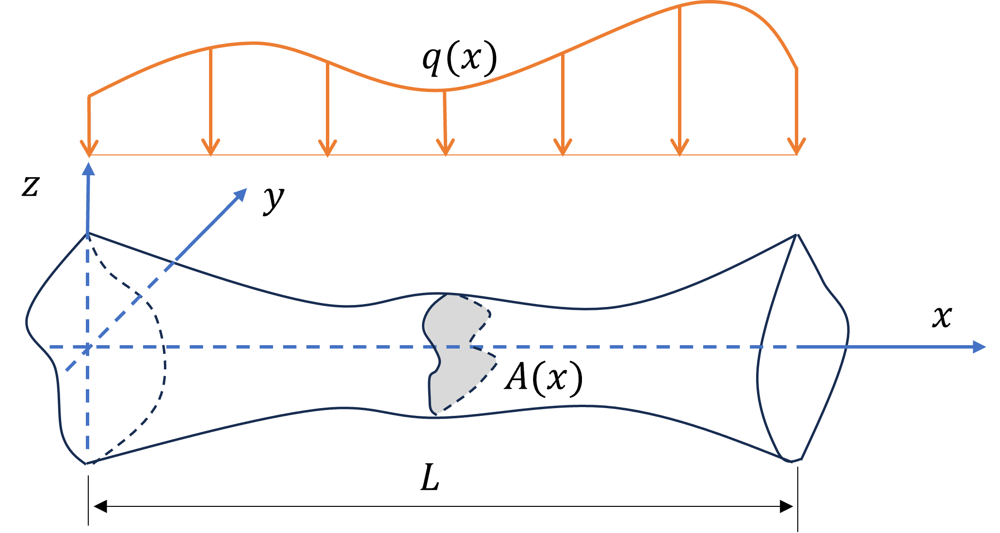
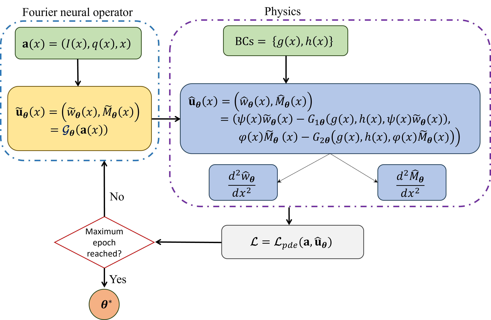

## Physics-informed Fourier neural operator: A neural operator framework for nonprismatic beam bending analysis
Abstract: Non-prismatic beams are widely used in civil and aerospace engineering due to their enhanced stiffness and efficient material use. However, conventional numerical methods like the finite element method become computationally expensive in parametric studies. Recent advances in physics-informed machine learning offer a promising alternative through surrogate modeling, enabling rapid prediction across varying parameters.
This study presents a physics-informed Fourier neural operator (PIFNO) framework for constructing a surrogate model of non-prismatic Euler–Bernoulli beams with variable cross-sections and distributed loads along their span. The model takes as input a specification of geometric properties and a distributed load profile along the beam’s length, and returns the corresponding displacement and bending moment fields.
The proposed framework begins by introducing the bending moment as an additional physically meaningful variable in the governing equations, thereby reformulating the original problem as a boundary value problem of reduced differential order. This problem is then transformed using a boundary shape function formulation, which ensures that the boundary conditions are inherently satisfied. A Fourier neural operator is trained to learn the parametric mapping from input configurations to output responses. The framework concludes with the optimization of the neural operator’s parameters.
The resulting PIFNO model enables efficient and accurate bending analysis of non-prismatic beams with arbitrary parametric inputs. Importantly, the framework is label-free, requiring no supervised training data, and is capable of accommodating a variety of boundary conditions.
Several numerical examples involving different types of non-prismatic beams are examined in this study. The maximum mean relative L<sub>2</sub> error between the approximated and reference output functions is recorded at 0.2&#37;. Furthermore, PIFNO demonstrates superior performance compared to the conventional physics-informed neural operator (PINO).

## Beam Configuration


## PIFNO Framework Overview


## Data Generation
Input data for training and testing the model are generated using the MATLAB scripts in the "matlab_code/" directory.

For example, to reproduce the clamped-simply supported beam scenario in Section 5.1:
 
* [eb_beam_linear_CS_1025_rng0.mat](https://drive.google.com/file/d/18AwUlXSMorQa-UM7Doe0w6imMBQ9fmzj/view?usp=sharing)

Additional input scenarios can be created using the same MATLAB scripts.

## Training and Testing 
### Train PIFNO
```bash 
python3 train_PIFNO.py --config_path configs/pretrain/eb-beam-pretrain.yaml --mode train
```

### Test PIFNO
```bash
python3 train_PIFNO.py --config_path configs/test/eb-beam.yaml --mode test
```

### Train PINO-o2
```bash 
python3 train_PINO-o2.py --config_path configs/pretrain/eb-beam-pretrain.yaml --mode train
```

### Test PINO-o2
```bash
python3 train_PINO-o2.py --config_path configs/test/eb-beam.yaml --mode test
```
*Note*: Configure bc_loss_l and bc_loss_r in the pretrain config YAML file to specify boundary condition weights.

### Train PINO-o4
```bash 
python3 train_PIFNO-o4.py --config_path configs/pretrain/eb-beam-pretrain.yaml --mode train
```

### Test PINO-o4
```bash
python3 train_PINO-o4.py --config_path configs/test/eb-beam.yaml --mode test
```
*Note*: Ensure out_dim is set to 1 in both config files for correct output dimension handling.


<!--
## Citation
If you think that the work of the PIFNO is useful in your research, please consider citing our paper in your manuscript:
```
@article{trung2025b,
  title={Physics-informed Fourier neural operator: A neural operator framework for nonprismatic beam bending analysis},
  author={Duy-Trung Vo, Jaehong Lee},
  journal={Engineering Structures},
  volume={},
  pages={},
  year={2025},
  publisher={Elsevier}
}
-->